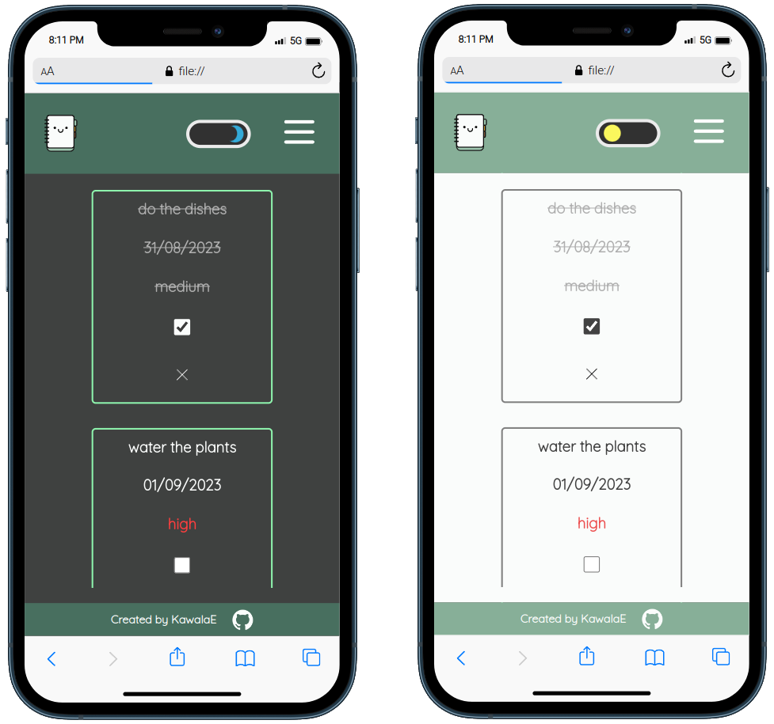

<h2><strong>Project description</strong></h2>

To-do is my personal coding project of a to-do list application using <b>JavaScript</b>, <b>HTML</b>, and <b>CSS</b>. I'm integrating <b>Webpack</b> for module management and bundling. Additionally, I'm utilizing local storage to ensure tasks are stored persistently. To maintain code quality and consistency, I've implemented <b>ESLint</b> for code linting and <b>Prettier</b> for code formatting. The app offers users the ability to add, edit, and delete tasks, categorize tasks into projects, sets priorities and due dates, and conveniently filter tasks by time periods like "This Week" and "This Month." Users also can mark tasks as complete. To-do is designed to align with users system color theme settings. Users have the power to switch between light and dark color theme. The app remembers users chosen color theme settings via local storage, ensuring their preferred theme is applied consistently.

<h2><a href="https://kawalae.github.io/To-do/">Click here to view!</a></h2>

<h3>Tech Stack</h3>
<ul>
<li><b>Front-end</b>: JavaScript, HTML, CSS,</li>
<li><b>Module Bundling</b>: Webpack,</li>
<li><b>Code Quality</b>: ESLint,</li>
<li><b>Code Formatting</b>: Prettier,</li>
<li><b>Data Storage</b>: Browser's Local Storage,</li>
<li><b>Code Structure</b>: Class oriented structure,</li>
</ul>

</img>
</img>
</img>
</img>
</img>
</img>

 
<h2><strong>Project:</strong></h2>
 

</img>

</img>

</img>

</img>

<h2><strong>Acknowledgements</strong></h2>

- <a href="https://www.svgrepo.com/collection/various-tritone-happy-icons/">Various Tritone Happy Icons Collection</a>
- <a target="_blank" href="https://icons8.com/icon/21278/css3">CSS</a> icon by <a target="_blank" href="https://icons8.com">Icons8</a>
- <a target="_blank" href="https://icons8.com/icon/PXTY4q2Sq2lG/javascript">JavaScript</a> icon by <a target="_blank" href="https://icons8.com">Icons8</a>
- <a target="_blank" href="https://icons8.com/icon/v8RpPQUwv0N8/html-5">Html 5</a> icon by <a target="_blank" href="https://icons8.com">Icons8</a>
- <a target="_blank" href="https://icons8.com/icon/sOWbK4N3cxGh/webpack">Webpack</a> icon by <a target="_blank" href="https://icons8.com">Icons8</a>
- <a href="https://www.svgrepo.com/svg/477075/hard-disk">Hard disk icon</a> 
